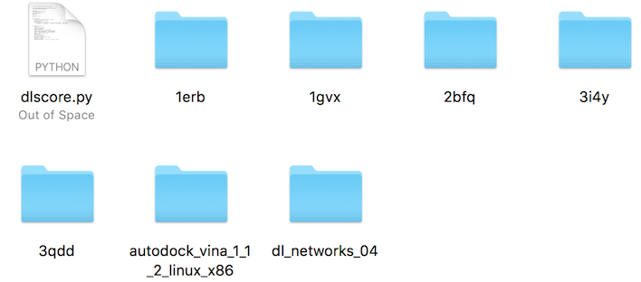

# DLSCORE: A deep learning based scoring function for predicting protein-ligand binding affinity.

Purpose: The main purpose of DLSCORE is to accurately predict binding affinities between a protein (target) and a ligand. 

DLSCORE is an ensemble of neural networks, trained on the recent release of the refined PDBBind data(v2016) using BINding ANAlyzer (BINANA ) descriptors. The dataset was divided into training and cross-validation with a total of 2,792 protein-ligand complexes, while the testing stage was performed with a total of 300.  


## Prerequisites

If you have all the prerequisites, you can move on to the testing stage. For the sake of simplicity, we included 5 folders with a protein and ligand each (in a .pdbqt format). Make sure you have a folder containing the following files/directories:

- dlscore2.py
- dl_networks_04/
- autodock_vina_1_1_2_linux_x86/
- 1gvx/ 
- 1erb/
- 3i4y/
- 2bfq/
- 3qdd/


At the end, your folder should look like this:



## Installing

To install python 3.5, please visit this [link](https://www.python.org/downloads/) and follow the instructions.


## Running the tests

We recommend to use the proteins and ligands (in a .pdbqt format) from [tests](https://github.com/sirimullalab/DLSCORE/tree/master/tests) to try DLSCORE. When running it, it should look like this:

`python dlscore.py -r receptor1/receptor1.pdbqt -l ligand1/ligand1.pdbqt -v path/to/vina -n 10 -o test`

Where:
````
-r stands for the receptor or protein (MUST BE in a pdbqt format)
-l stands for the ligand (MUST BE in a pdbqt format)
-v is the path to Autodock Vina
-n is the desired number of networks
-o is the name of the output file (no need to add a .csv extension)
````

We recommend setting `-n` to 10, as it has been shown to give the optimum results (highest Pearson, Spearman and Kendall correlation coefficients, and lowest RMSE and MAE values).

The command to run DLSCORE should look this:

`
python dlscore.py -r 1erb/1erb_protein.pdbqt -l 1erb/1erb_ligand.pdbqt -v autodock_vina_1_1_2_linux_x86/bin/vina -n <number_of_networks> -o output_file
`

And the output (with some parameter and warning messages displayed) should be:

`
[{'vina_output': -8.31353, 'nnscore': 7.607969605308547, 'dlscore': 7.1239998340606689}]
`

DLSCORE will be producing the number of networks specified with in `-n`, NNScore 2.0 will display 20, and vina 1 (plus 5 . The output thrown by DLSCORE and NNScore 2.0 are pKd values, while Vina gives delta G (kcal/mol)

The same applies for the rest of the proteins and ligands. To see the rest of the protein-ligand complexes for our dataset (300 from PDBbind v.2016 refined-set), please read our [research article](https://doi.org/10.26434/chemrxiv.6159143.v1)


## Contributing

If you wish to contribute, submit pull requests or read more about our code of conduct, please read [CONTRIBUTING.md](https://github.com/sirimullalab/DLSCORE/blob/master/CONTRIBUTING.md)

## Authors

Mahmudulla Hassan , Dr. Olac Fuentes, Dr. Suman Sirimulla, Daniel Castaneda Mogollon, Ricardo Avila.

See also the list of [contributors](https://github.com/sirimullalab/DLSCORE/blob/master/contributors) who made this project possible.

## Funding
This work is supported by Dr. Suman Sirimulla’s startup fund from UTEP School of Pharmacy.

## Acknowledgments
We would like to thank [Patrick Walters](https://github.com/PatWalters) for sharing his [metk](https://github.com/PatWalters/metk) code and strengthing our statistical results.


<<<<<<< HEAD
=======

>>>>>>> branch-hassan
